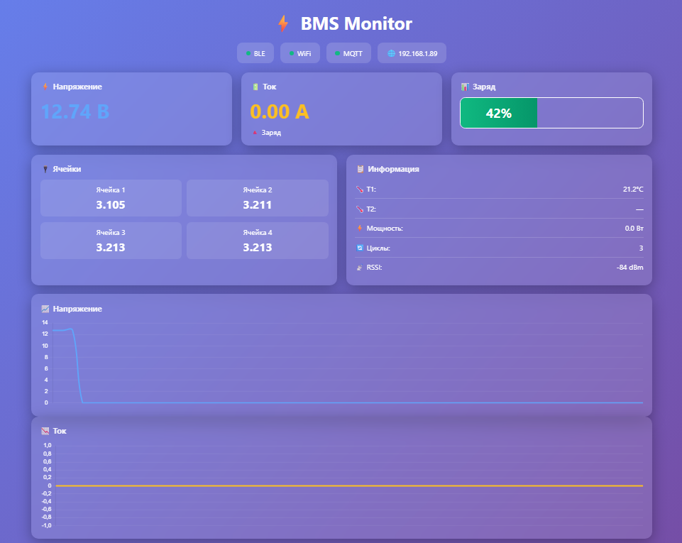
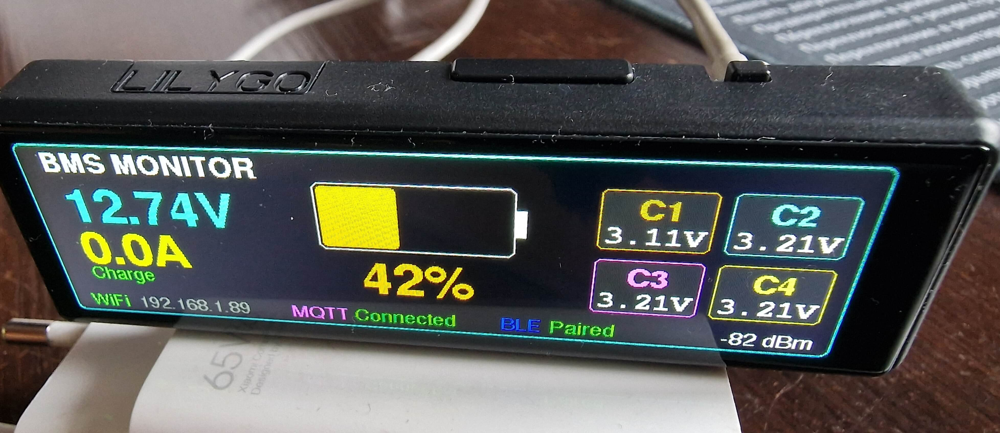

# 🔋 BMS Monitor ESP32-S3

Профессиональный монитор для BMS JBD/Xiaoxiang (LiFePO4 батарей (4S)) на базе lilygo t display s3 long , веб-интерфейсом и MQTT интеграцией.


---

## 📸 Демонстрация

### Веб-интерфейс

*Адаптивный дашборд с графиками в реальном времени*

### AMOLED дисплей

*Красочный интерфейс 640×180 с информацией о батарее*

---

## ✨ Основные возможности

- 📺 **AMOLED дисплей 640×180**  
  Яркий дисплей с контроллером AXS15231B, отображение напряжения, тока, SOC, температуры и напряжений по ячейкам

- 🌐 **Веб-интерфейс с живыми графиками**  
  Адаптивный дизайн с Chart.js, обновление каждую секунду, история за 60 секунд

- 📡 **Bluetooth BLE подключение**  
  Автоматическое сканирование и подключение к JBD/Xiaoxiang BMS

- 📊 **MQTT интеграция**  
  Публикация данных каждые 5 секунд для Home Assistant и других систем автоматизации

- 🔋 **Полный мониторинг батареи**  
  - Общее напряжение (V)
  - Ток заряда/разряда (A)
  - Уровень заряда SOC (%)
  - Температура (T1, T2)
  - Напряжение по каждой ячейке
  - Количество циклов
  - Мощность (Вт)

- 📈 **История данных**  
  60-секундные графики напряжения и тока в веб-интерфейсе

- 🎨 **Красивый UI**  
  Градиентный дизайн, анимации статусов, цветовая индикация

---

## 🛠 Аппаратная часть

### Компоненты

| Компонент | Описание |
|-----------|----------|
| **Микроконтроллер** | lilygo t display s3 long |
| **Дисплей** | lilygo t display s3 long |
| **BMS** | JBD/Xiaoxiang для LiFePO4 4S с Bluetooth |
| **Батарея** | LiFePO4 4S (номинал 12.8V, полный заряд ~14.6V) |

### Распиновка дисплея

```cpp
#define TFT_QSPI_CS      12
#define TFT_QSPI_SCK     17
#define TFT_QSPI_D0      13
#define TFT_QSPI_D1      18
#define TFT_QSPI_D2      21
#define TFT_QSPI_D3      14
#define TFT_QSPI_RST     16
#define TFT_BL           1
```

⚠️ **ВАЖНО:** Дисплей инициализируется **первым** в setup(), так как выделяет ~225KB PSRAM для буфера поворота экрана.

---

## 📚 Необходимые библиотеки

Установите через **Arduino IDE Library Manager**:

1. **TFT_eSPI** от Bodmer
2. **ArduinoJson** от Benoit Blanchon
3. **PubSubClient** от Nick O'Leary
4. **AsyncTCP** от me-no-dev ([GitHub](https://github.com/me-no-dev/AsyncTCP))
5. **ESPAsyncWebServer** от lacamera ([GitHub](https://github.com/me-no-dev/ESPAsyncWebServer))

**Примечание:** AsyncTCP и ESPAsyncWebServer могут потребовать ручной установки через ZIP:
```
Sketch → Include Library → Add .ZIP Library...
```

---

## 🚀 Быстрый старт

### 1. Клонирование репозитория

```bash
git clone https://github.com/yourusername/BMS-Monitor-ESP32.git
cd BMS-Monitor-ESP32
```

### 2. Настройка WiFi и MQTT

Откройте `displayBLEwifimqtt/displayBLEwifimqtt.ino` и измените:

```cpp
// WiFi настройки
const char* ssid = "YOUR_WIFI_SSID";
const char* password = "YOUR_WIFI_PASSWORD";

// MQTT настройки
const char* mqtt_server = "192.168.1.33";      // IP вашего MQTT брокера
const int mqtt_port = 1883;
const char* mqtt_user = "YOUR_MQTT_USER";
const char* mqtt_password = "YOUR_MQTT_PASSWORD";
```

### 3. Настройка платы в Arduino IDE

```
Инструменты → Плата → esp32 → ESP32S3 Dev Module

Настройки:
├─ USB CDC On Boot: Enabled
├─ Flash Mode: QIO 80MHz
├─ Flash Size: 8MB (или 4MB)
├─ Partition Scheme: 8M with SPIFFS (или Huge APP)
├─ PSRAM: OPI PSRAM (или QSPI PSRAM)
└─ Upload Speed: 921600
```

### 4. Загрузка прошивки

1. Подключите ESP32-S3 через USB
2. Выберите правильный COM порт
3. Нажмите **Upload** (Ctrl+U)

### 5. Первый запуск

После загрузки откройте Serial Monitor (115200 baud):

```
BMS Monitor Starting...
Step 1: Display init
Allocating qBuffer from PSRAM...
qBuffer allocated successfully!
Display OK!

Step 2: BLE init
BLE scanning...

Step 3: WiFi init
Connecting to WiFi: YOUR_SSID
....
WiFi connected!
IP: 192.168.1.89
RSSI: -77

Step 4: MQTT setup
MQTT connected!

Setup complete!
Web: http://192.168.1.89
```

Откройте указанный IP в браузере! 🎉

---

## 🌐 Использование веб-интерфейса

После подключения к WiFi перейдите по адресу:
```
http://IP_АДРЕС_ESP32
```

### Возможности веб-интерфейса

- **Живые данные:** обновление каждую секунду
- **Статусы подключений:** BLE / WiFi / MQTT (зелёные/красные индикаторы)
- **Напряжение батареи:** большие цифры, цветовая индикация
- **Ток:** с указанием заряд/разряд 🔺🔻
- **Анимированная батарея:** визуальный SOC с цветами (красный < 20%, оранжевый < 50%, зелёный ≥ 50%)
- **Ячейки:** напряжение каждой ячейки в вольтах
- **Графики:** Chart.js графики напряжения и тока за последние 60 секунд
- **Информация:** температура, мощность, циклы, RSSI WiFi

---

## 📡 MQTT топики

Данные публикуются каждые **5 секунд** (при активном BLE и MQTT):

### `bms/status` - основные параметры

```json
{
  "voltage": 13.26,
  "current": -16.11,
  "soc": 100,
  "temp1": 16.1,
  "temp2": -273.1,
  "cycles": 45,
  "power": -213.7,
  "rssi": -77
}
```

### `bms/cells` - напряжения ячеек

```json
{
  "cells": [3.31, 3.32, 3.31, 3.32],
  "count": 4,
  "min": 3.31,
  "max": 3.32,
  "delta": 0.01
}
```

### `bms/system` - системные события

```json
{
  "status": "online"
}
```

---

## 🏠 Интеграция с Home Assistant

Добавьте в `configuration.yaml`:

```yaml
mqtt:
  sensor:
    - name: "BMS Voltage"
      state_topic: "bms/status"
      value_template: "{{ value_json.voltage }}"
      unit_of_measurement: "V"
      device_class: voltage
      state_class: measurement

    - name: "BMS Current"
      state_topic: "bms/status"
      value_template: "{{ value_json.current }}"
      unit_of_measurement: "A"
      device_class: current
      state_class: measurement

    - name: "BMS SOC"
      state_topic: "bms/status"
      value_template: "{{ value_json.soc }}"
      unit_of_measurement: "%"
      device_class: battery
      state_class: measurement

    - name: "BMS Temperature 1"
      state_topic: "bms/status"
      value_template: "{{ value_json.temp1 }}"
      unit_of_measurement: "°C"
      device_class: temperature
      state_class: measurement

    - name: "BMS Power"
      state_topic: "bms/status"
      value_template: "{{ value_json.power }}"
      unit_of_measurement: "W"
      device_class: power
      state_class: measurement

    - name: "BMS Cycles"
      state_topic: "bms/status"
      value_template: "{{ value_json.cycles }}"
      icon: mdi:recycle

    - name: "BMS Cell 1"
      state_topic: "bms/cells"
      value_template: "{{ value_json.cells[0] }}"
      unit_of_measurement: "V"
      device_class: voltage

    - name: "BMS Cell Delta"
      state_topic: "bms/cells"
      value_template: "{{ value_json.delta }}"
      unit_of_measurement: "V"
      icon: mdi:delta
```

После перезапуска Home Assistant все сенсоры появятся автоматически!

---

## 🔧 Техническая информация

### Порядок инициализации (критично!)

```cpp
void setup() {
  // 1. ДИСПЛЕЙ - ПЕРВЫМ! (выделяет 225KB PSRAM)
  axs15231_init();
  sprite.createSprite(640, 180);

  // 2. BLE - вторым
  BLEDevice::init("");
  pBLEScan->start(10, false);

  // 3. WiFi - третьим
  WiFi.begin(ssid, password);

  // 4. MQTT - последним
  mqttClient.setServer(mqtt_server, mqtt_port);

  // 5. Web сервер
  setupWebServer();
}
```

### Протокол BMS (JBD/Xiaoxiang)

**UUID сервиса:** `0000ff00-0000-1000-8000-00805f9b34fb`  
**TX характеристика:** `0000ff02-0000-1000-8000-00805f9b34fb`  
**RX характеристика:** `0000ff01-0000-1000-8000-00805f9b34fb`

**Команды:**
- `0x03` - Basic Info (напряжение, ток, SOC, температура, циклы)
- `0x04` - Cell Voltages (напряжения по ячейкам)

**Формат команды:**
```
DD A5 [CMD] 00 FF [CHECKSUM] 77
```

**Частота опроса:** каждые 2 секунды (чередование 0x03 и 0x04)

### Оптимизация памяти

- **qBuffer:** 225KB в PSRAM (для поворота дисплея на 90°)
- **История данных:** 60 точек × 4 байта × 2 массива = 480 байт RAM
- **Sprite buffer:** 640×180×2 = 225KB PSRAM
- **AsyncWebServer:** не блокирует основной цикл

---

## 🐛 Решение проблем

### Дисплей не работает

- ✅ Проверьте подключение всех QSPI пинов
- ✅ Убедитесь что PSRAM включен в настройках платы
- ✅ В Serial Monitor должно быть: `qBuffer allocated successfully!`
- ✅ Попробуйте снизить SPI частоту до 20MHz в `pins_config.h`

### BLE не находит BMS

- ✅ Включите Bluetooth на BMS (обычно автоматически)
- ✅ Проверьте расстояние (< 5 метров, без препятствий)
- ✅ Убедитесь что BMS не подключена к другому устройству
- ✅ Проверьте UUID в коде (должен совпадать с вашей BMS)

### WiFi слабый сигнал (RSSI < -80)

- ✅ Переместите ESP32 ближе к роутеру
- ✅ Используйте внешнюю антенну (если есть разъем)
- ✅ Проверьте помехи от металлического корпуса батареи
- ✅ Попробуйте другой WiFi канал на роутере

### MQTT не подключается

- ✅ Проверьте доступность брокера: `ping 192.168.1.33`
- ✅ Убедитесь что порт 1883 открыт
- ✅ Проверьте логин/пароль MQTT
- ✅ В Serial Monitor смотрите код ошибки: `rc=` ([-4]=timeout, [-2]=refused)

### Веб-интерфейс не открывается

- ✅ Проверьте IP адрес в Serial Monitor
- ✅ Убедитесь что устройства в одной сети
- ✅ Попробуйте отключить firewall/антивирус
- ✅ Проверьте что порт 80 не занят

### Температура T2 показывает -273.1°C

- ℹ️ Это нормально! Второй датчик температуры не подключен к BMS
- ℹ️ В коде есть проверка: если T2 < -200°C, показывается "—"

---

## 📊 Характеристики производительности

- **Частота обновления дисплея:** ~2 FPS (каждые 500ms)
- **Опрос BMS:** каждые 2 секунды
- **MQTT публикация:** каждые 5 секунд
- **Веб API:** обновление каждую секунду
- **История данных:** 60 точек (60 секунд)
- **Потребление:** ~150mA @ 5V (с включенным дисплеем)

---

## 📝 TODO / Планы развития

- [ ] Поддержка 8S/12S/16S батарей
- [ ] Логирование на SD карту
- [ ] Push уведомления при критических значениях
- [ ] OTA обновления через веб-интерфейс
- [ ] Поддержка других BMS (Daly, ANT, Seplos)
- [ ] Настройка параметров через веб
- [ ] Экспорт истории в CSV
- [ ] Темная/светлая тема веб-интерфейса
- [ ] Мультиязычность (EN/RU/CN)

---

## 🤝 Вклад в проект

Pull requests приветствуются! Для крупных изменений сначала откройте issue для обсуждения.

### Как помочь проекту

1. ⭐ Поставьте звезду на GitHub
2. 🐛 Сообщайте об ошибках через Issues
3. 💡 Предлагайте новые функции
4. 📝 Улучшайте документацию
5. 🔧 Отправляйте Pull Requests

### Правила для PR

- Следуйте существующему стилю кода
- Тестируйте изменения перед отправкой
- Обновляйте README при добавлении функций
- Одна функция = один PR

---

## 📄 Лицензия

**MIT License**

```
Copyright (c) 2025 maltim

Permission is hereby granted, free of charge, to any person obtaining a copy
of this software and associated documentation files (the "Software"), to deal
in the Software without restriction, including without limitation the rights
to use, copy, modify, merge, publish, distribute, sublicense, and/or sell
copies of the Software, and to permit persons to whom the Software is
furnished to do so, subject to the following conditions:

The above copyright notice and this permission notice shall be included in all
copies or substantial portions of the Software.

THE SOFTWARE IS PROVIDED "AS IS", WITHOUT WARRANTY OF ANY KIND, EXPRESS OR
IMPLIED, INCLUDING BUT NOT LIMITED TO THE WARRANTIES OF MERCHANTABILITY,
FITNESS FOR A PARTICULAR PURPOSE AND NONINFRINGEMENT. IN NO EVENT SHALL THE
AUTHORS OR COPYRIGHT HOLDERS BE LIABLE FOR ANY CLAIM, DAMAGES OR OTHER
LIABILITY, WHETHER IN AN ACTION OF CONTRACT, TORT OR OTHERWISE, ARISING FROM,
OUT OF OR IN CONNECTION WITH THE SOFTWARE OR THE USE OR OTHER DEALINGS IN THE
SOFTWARE.
```

---

## 🙏 Благодарности

- **[Bodmer](https://github.com/Bodmer)** за библиотеку TFT_eSPI
- **[me-no-dev](https://github.com/me-no-dev)** за AsyncTCP и ESPAsyncWebServer
- **[Chart.js](https://www.chartjs.org/)** за отличные графики
- **ESP32 сообщество** за поддержку и примеры
- **JBD/Xiaoxiang** за открытость протокола BMS

---

## 👤 Автор

**maltim**  
📍 Almaty, Kazakhstan 🇰🇿  
🔧 Embedded Systems Enthusiast | Home Automation | IoT

---

## 📞 Контакты и поддержка

- 🐛 **Сообщить об ошибке:** [GitHub Issues](https://github.com/yourusername/BMS-Monitor-ESP32/issues)
- 💬 **Обсуждение:** [GitHub Discussions](https://github.com/yourusername/BMS-Monitor-ESP32/discussions)
- ⭐ **Понравился проект?** Поставьте звезду на GitHub!

---

<div align="center">

**Сделано с ❤️ в Казахстане**

[⬆ Вернуться к началу](#-bms-monitor-esp32-s3)

</div>
